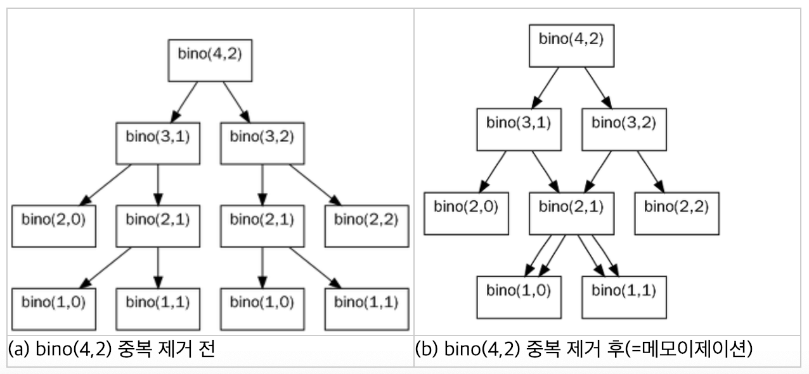

# 유형 별 알고리즘 문제 풀이법

## 1. Hash (해시)
### 1.1. 해시맵 선언

```java
  import java.util.*;

  HashMap<String, Integer> hm = new HashMap<>(); // *Java 8 이후 "=" 이하 오토 박싱
```

### 1.2. 해시맵에 값 대입
```java
  hm.put("abc", 1); // "abc" 라는 문자열 고유한 키 값과 1이라는 벨류 값 대입
```

### 1.3. 해시맵 순회
```Java
  for (String key : hm.keySet()) {
    System.out.println(hm.get(key)); // 해시맵을 차례로 순회하면서 벨류 값을 출력
  }

  for (Integer value : hm.values()) {
    System.out.println(value); // 해시맵을 차례로 순회하면서 벨류 값을 출력
  }
```

### 1.4. 응용
- 해시맵의 특성을 이용하여 특정 유형의 문제를 풀이할 수 있다.
- 예를 들어, 키 값이 중복되지 않기 때문에 같은 키 값이 들어오면 중복이 되지 않아 값이 덮일 수 있다.
- 해당 특성을 다룰 수 있는 함수가 존재한다. (```getOrDefault```)

```Java
  hm.put(type, hm.getOrDefault(type, 0) + 1);
  // 이렇게 해주면 type이라는 중복되지 않는 키에 해당하는 벨류 값이 처음에 들어간 이후
  // 같은 키 값을 대입하면 원래 존재하는 값에 + 1을 하여 업데이트 해준다.
```

### 1.5. 정렬
- 해시맵은 키와 값의 엔트리를 인자로 가지고 있는 자료구조이다.
- 해당 키와 값을 기준으로 다르게 정렬을 수행해줄 수 있다.

#### 1.5.1. Key를 기준으로 정렬
- 기본 개념은 트리맵과 맵을 이용한다.
- 트리 맵에 맵을 그대로 삽입하면 내림차순으로 정렬된다.
- 오름차순으로 정렬하려면 트리맵을 역순으로 선언하고 그대로 맵의 엔트리를 대입해주면 된다.

```Java
  Map<Object, Object> keySort = sortByKey(hm, true);

  public static Map<Object, Object> sortByKey (final Map map, boolean isASC) {
    if (isASC) {
      // 해시맵은 트리맵에 그대로 대입해주면 내림차순으로 정렬된다.
      return new TreeMap<Object, Object>(map);
    } else {
      // 오름차순으로 정렬하려면 트리맵 객체를 역순으로 선언하고 기존 맵의 모든 요소를 그대로 넣는다.
      TreeMap<Object, Object> tree = new TreeMap<Collections.reverseOrder());
      tree.putAll(map);
      return tree;
    }
  }
```

#### 1.5.2. Value를 기준으로 정렬
- 기본 개념은 **LinkedList** 와 맵을 이용한다.
- **LinkedList** 를 선언하고 ```Collections.sort``` 를 이용하여 ```Map.Entry``` 요소들을 비교한다.
- 구체적인 내부 구현은 ```new Comparator()``` 를 활용한다.
- 내림차순 정렬은 역순으로 한번 더 선언한다.
- 최종적으로 **List** 를 순회하면서 각 엔트리에 해당하는 키와 값을 새로운 해시맵에 대입하여 반환한다.

```Java
  Map<Object, Object> valueSort = sortByValue(hm, true);

  public static Map<Object, Object> sortByValue (final Map map, boolean isASC) {
    List list = new LinkedList(map.entrySet());

    Collections.sort(list, new Comparator(){
      public int compare (Object o1, Object o2) {
        return ((Comparable) ((Map.Entry)(o1)).getValue()).compareTo(((Map.Entry)(o2)).getValue());
      }
    });

    if (isASC) {
      Collections.reverse(list);
    }

    HashMap sortedHashMap = new LinkedHashMap();

    for (Object obj : list) {
      Map.Entry entry = (Map.Entry)obj;
      sortedHashMap.put(entry.getKey(), entry.getValue());
    }

    return sortedHashMap;
  }
```

## 2. Stack (스택) & Queue (큐)
### 2.1. 스택 및 큐 선언
- 자바에서의 큐는 인터페이스 구현이기 때문에 ```offer``` 와 ```poll``` 과 같은 기본 메소드를 구현해주어야 한다.
- 따라서 ```Deque``` 를 선언해 ```ArrayDeque``` 로 인스턴스를 생성한다.

```java
import java.util.*;

Stack st = new Stack(); // 기본적인 스택 선언
Stack<Integer> Integerst = new Stack<>(); // 정수형 값을 담는 스택 선언
Deque<Integer> deque = new ArrayDeque<>(); // 정수형 값을 담는 큐 선언
```

### 2.2. 요소 삽입 및 반환
- **스택** 은 ```push``` 와 ```pop```을 통해 삽입과 반환을 구현한다.
- **큐** 는 ```offer``` 와 ```poll```을 통해 삽입과 반환을 구현한다.

```Java
st.push(1); // Stack st 에 1을 삽입
st.pop(); // st라는 스택에 들어간 자료형 중 가장 앞에있는 요소를 제거하고 반환한다.

deque.offer(1); //  deque에 1을 삽입
System.out.println(deque.peek()); // deque의 가장 앞 요소를 확인하여 반환한다.
deque.poll(); // deque의 가장 앞에 있는 요소를 제거하고 반환한다.
```

### 2.2. 응용
- **스택** 과 **큐** 는 딱히 응용이랄 것이 없다.
- 기본적인 ```FIFO```, ```FILO``` 구조에 맞추어 적당히 구현해주면 된다.

## 3. 힙 (Heap)
- 힙은 데이터에서 최대 값 (혹은 최소 값)을 빠르게 찾을 수 있는 자료구조이다.
- 힙은 완전 이진 트리이다.
- 우선 순위가 가장 높은 데이터가 제일 앞(루트)에 위치한다.
- 부모는 자식보다 우선 순위가 더 높은 데이터가 배치된다.
- 대표적으로 최대 힙과 최소 힙이 있다.

### 3.1. 힙 (우선순위 큐) 선언
- 자바에서의 힙은 ```PriorityQueue``` 로 선언될 수 있다.

```java
  PriorityQueue<Integer> maxHeap = new PriorityQueue<>((a, b) -> b-a); // 람다식을 이용하여 최대 힙을 구현할 수 있다.
  PriorityQueue<Integer> minHeap = new PriorityQueue<>((a, b) -> a-b); // 최소 힙은 디폴트 값으로 설정되어 있다.   
```

### 3.2. 요소 삽입 및 반환
- 힙은 우선순위 큐로써 큐와 같은 구조를 가지고 있다.
- 따라서, 삽입은 ```offer()``` 메소드를 이용하고, 반환은 ```poll()``` 메소드를 이용하면 된다.

### 3.3. 응용
- 기본적인 객체를 담을 수도 있고, 또한 객체의 요소를 람다식을 이용하여 비교하는 방식으로 정렬할 수도 있다.
```Java
  Arrays.sort(jobs, new Comparator<int[]>() {
    @Override
    public int compare (int[] o1, int[] o2) {
      if (o1[0] != o2[0]) // 만약에 호출하는 시간이 같지 않다면
      return o1[0] - o2[0]; // 호출 시간이 빠른 순서대로 정렬
      return o1[1] - o2[1]; // 만약에 호출 시간이 같다면 걸리는 시간이 짧은 순서대로 정렬
    }
  });

  // 별개의 영역이지만 힙 문제 중 디스크 컨트롤러 문제에서
  // 기본 숫자 배열 정렬하는 방법을 구현한 코드이다.
```

## 4. 정렬 (Sorting)
- 정렬을 하는 방법은 크게 3가지가 있다.
  1. Arrays.sort();
  2. Collections.sort();
  3. new Comparator<>();

- 단순한 오름차순 정렬은 1, 2를 이용한다.
- 내림차순 정렬은 2번을 이용하고 ```Collections.reverse()``` 를 이용한다.
- 그 외 조건부 정렬을 구현하려고 할 때는 Comparator를 이용한다.

### 4.1. 정렬의 구현
```Java
  Arrays.sort(jobs); // 오름차순 정렬
  Collections.sort(arrayList); // 오름차순 정렬
  Collections.reverse(arrayList); // 역순, 즉 내림차순 정렬
```

### 4.2. 응용
```Java
  Arrays.sort(num, new Comparator<String>() {
    @Override
    public int compare(String o1, String o2) {
      return (o2 + o1).compareTo(o1 + o2);
    }
  });
  // 문자열 두 개를 이어 붙인 것 중에 큰 순서대로 정렬
  // 내림차순 (디폴트가 오름차순이기 때문에) return 을 역순으로!
```

## 5. 완전 탐색 (BruteForce)
- 모든 케이스를 하나하나 다 탐색하는 방법이다.
- 주로 반복문으로 순회를 한다.

### 5.1. 응용
- 완전 탐색은 응용 예제를 중심으로 살펴보자

#### 5.1.1 모의고사
```Java
  int[] answer1 = {1, 2, 3, 4, 5}; // 찍는 순서의 배열을 넣는다.
  int index1 = i%5 // 0 - 4 까지의 나머지가 나오기 때문에 이것을 위의 정수 배열의 인덱스로 접근한다.
```

#### 5.1.2 소수 찾기
```Java
  // 모든 숫자의 조합을 찾기 위해서 DFS를 활용하여 순열을 구현한다.

  public static void func (String s, String number, ArrayList<String> stringArrayList) {
    if (number.length() == 0) {
      if (!s.equals(""))
        stringArrayList.add(s):
    } else {
      for (int i=0; i<number.length(); i++) {
        func(s + number.charAt(i), number.substring(0, i) + number.substring(i+1, number.length()), stringArrayList);
        for (int i=0; i<number.length(); i++) {
          func(s, number.substring(0, i) + number.substring(i+1, number.length()), stringArrayList);
        }
      }
    }
  }

  // 그 후에 중복된 값을 HashSet을 이용하여 거르고
  // 순회를 하면서 소수를 찾는다.
```

#### 5.1.3 숫자 야구
- 숫자 야구는 중복되지 않는 0 - 9까지의 숫자의 조합이기 떄문에 3중 반복문을 돌린다.
- 중간에 중복되지 않는 경우이기 때문에 각 자리 숫자가 같아지는 경우는 ```continue``` 키워드를 사용하여 넘긴다.
- **String** 값을 **Integer** 로 바꿀 때는 ```Integer.parseInt(s)``` 를 사용한다.
- 반대의 경우는 ```String.valueOf(i)``` 를 사용한다.

```Java

for (int i=1; i<10; i++) {
            for (int j=1; j<10; j++) {
                if (j==i) continue;
                for (int k=1; k<10; k++) {
                    if (k==j || k==i) continue;

                    boolean isTrue = true;

                    for (int t=0; t<baseball.length; t++) {

                        String num = String.valueOf(baseball[t][0]);
                        int strike = 0;
                        int ball = 0;

                        if (i == Integer.parseInt(String.valueOf(num.charAt(0)))) {
                            strike++;
                        } else if (i == Integer.parseInt(String.valueOf(num.charAt(1))) || i == Integer.parseInt(String.valueOf(num.charAt(2)))) {
                            ball++;
                        }

                        if (j == Integer.parseInt(String.valueOf(num.charAt(1)))) {
                            strike++;
                        } else if (j == Integer.parseInt(String.valueOf(num.charAt(0))) || j == Integer.parseInt(String.valueOf(num.charAt(2)))) {
                            ball++;
                        }

                        if (k == Integer.parseInt(String.valueOf(num.charAt(2)))) {
                            strike++;
                        } else if (k == Integer.parseInt(String.valueOf(num.charAt(0))) || k == Integer.parseInt(String.valueOf(num.charAt(1)))) {
                            ball++;
                        }

                        if (strike != baseball[t][1] || ball != baseball[t][2]) isTrue = false;

                        if (!isTrue) break;
                    }

                    if (isTrue) answer++;
                }
            }
        }
```

## 6. 동적 계획법 (Dynamic Programming)
- **동적 계획법** 은 큰 문제를 작은 문제로 나누어서 푸는 알고리즘이다.

### 6.1. 큰 문제를 작은 문제로
- **동적 계획법** 은 큰 문제를 작은 문제로 나누어서 푸는 기법이다.
- 그래서 **DP**의 핵심이 ```큰 문제를 작은 문제로 나눠서 푼다.``` 이다.
- **분할 정복** 과 근본적인 차이는 **메모이제이션** 이다.
- **DP** 는 계산한 이전의 값을 계속해서 사용하는데 반해 **분할 정복** 은 계산한 부분 문제를 한번만 사용한다.

### 6.2. 메모이제이션 (Memoization)
- 동적계획법 알고리즘의 대표적인 예 중 하나는 이항 계수의 계산이다.
- ```bino(a, b) = bino(a-1, b) + bino(a-1, b-1) 이라고 정의해보자.
- ```bino(4, 2)``` 를 호출했을 떄 아래와 같이 함수가 재귀적으로 호출된다.



- **DP** 에서는 이처럼 중복된 계산을 막기 위해 **저장된 결과를 배열에 저장한뒤, 다음에 계산이 필요할 때는 저장된 값을 불러와서 중복을 없애면 함수 호출이 줄어든다.**
- 따라서, **시간 복잡도** 또한 훨씬 줄어들게 된다.
- 이러한 기법을 **메모이제이션(Memoization)** 이라고 한다.

### 6.3. TOP-DOWN
- 재귀와 같은 방식으로 **위에서 아래로 내려오는 방식이다.**
- **함수 호출을 줄이기 위해,** 앞서 말했던 **메모이제이션** 을 사용한다.

```java
// (a) 일반 재귀
public int fib(int n) {
  if (n == 1 || n == 2)
    return 1;
  return fin(n-1) + fib(n-2);
}

// (b) 메모이제이션을 적용한 TOP-DOWN 방식 DP
public int fib(int n) {
  if (n == 1 || n == 2)
    return 1;
  if (!memo[n])
    return memo[n];
  memo[n] = fib(n-1) + fib(n-2);
  return memo[n];
}
```

### 6.4. BOTTOM-UP
- TOP-DOWN 방식과 달리, **for 문을 이용해서 처음 값부터 다음 값을 계산해 나가는 방식** 이다.

```Java
public int fib(int n) {
    memo[0] = 0;
    memo[1] = 1;
    for (int i=2; i<=n; i++) {
      memo[i] = memo[i-1] + memo[i-2];
    }
    return memo[n];
}
```

### 6.5. 동적계획법의 이용
- **DP** 알고리즘은 최적 값을 구할 때 주로 사용한다.
- 동적계획법은 중요한 알고리즘 중 하나이기 때문에 대회에도 많이 나올 뿐만 아니라 관련된 문제도 많다.

### 6.6. DP 가이드
#### 6.6.1. **동적 계획법(DP)** 기반의 알고리즘 동작 방식
1. 구하고자 하는 큰 문제를 작은 부분 문제로 나눈다.
2. 가장 작은 부분 문제 (종료 조건, 주로 0 또는 1 일때)부터 푼 뒤 값을 저장한다.
3. 메모이제이션된 부분 문제들의 해를 이용하여 차례로 더 큰 상위 문제의 답을 구한다.
4. (3) 과정을 가장 큰 문제에 도달할 때까지 반복한다.

#### 6.6.2. 동적 계획법(DP) 문제 해결 방법
1. 몇 차원 DP를 할 것인가?
2. 변수 개수가 정해졌으면 각각의 변수가 무슨 의미인가?
3. DP 값이 어떤 의미인가?
4. 어떤 DP 값과 다른 DP 값의 관계가 있는가?
  (**DP 테이블을 채워보면 쉽게 알 수 있다.**)
5. 4의 점화식을 이용하여 재귀 또는 for문 DP로 계산한다.

#### 6.6.3. 동적 계획법의 초기화
동적 계획법에서 **메모이제이션** 말고 또 중요한 것이 **초기화**이다.
**이미 계산한 것을 다시 계산하지 않기 위해서는 계산한 것과 계산하지 않은 것의 차이가 있어야 한다.**
계산하지 않은 값은 초기 값 그대로이고 계산한 값은 바뀌어 있기 때문에 그것을 구분한다.
따라서 동적 계획법에서 계산한 값의 범위를 대략적으로 알아내서 그 범위에 있지 않은 값으로 초기화를 해주어야 한다. **계산된 값이 0일 수 있는 동적 계획법의 경우에는 보통 -1 을 사용하고 계산된 값이 0일 수 없는 경우에는 그냥 전역 변수로 선언한다.**

#### 6.6.4 TOP-DOWN VS BOTTOM-UP
**TOP-DOWN** 방식에 **메모이제이션** 을 했다는 가정하에 시간복잡도는 같다.
하지만 실제 걸리는 시간은 **TOP-DOWN** 이 더 길다고 일반적으로 알려져 있다.
**재귀 DP의 장점은 점화식 그대로 호출이 되기 때문에 형식과 순서에 얽매이지 않는다.**
후자의 장점은 **시간이 조금 적게 걸린다는 것**이다.
